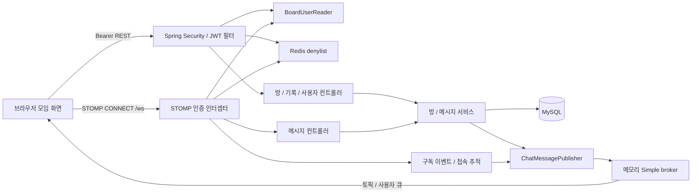
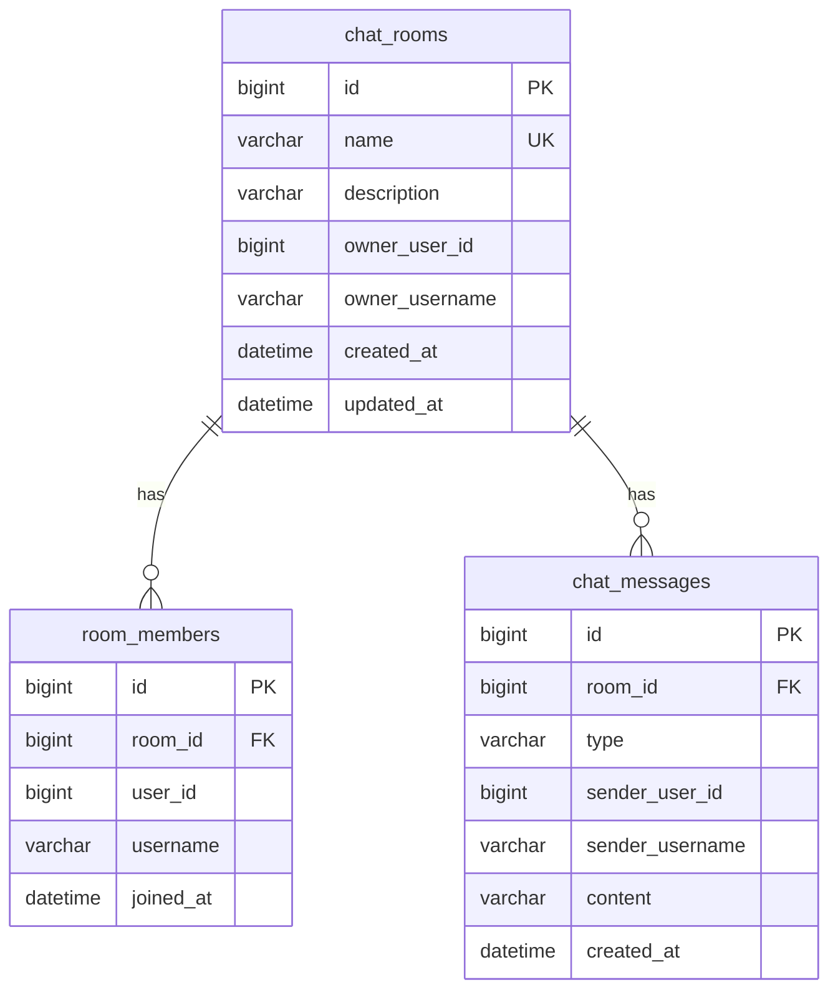

# 전체 구조

## 요청 흐름

프론트엔드 소스는 루트의 `frontend/index.html`과 `frontend/assets/`에 있습니다. Gradle `processResources`가 이 웹 자산을 `build/resources/main/static/`에 복사하고 Spring Boot가 `/`와 `/assets/**`에서 제공합니다. 프론트엔드에 API 호스트를 하드코딩하지 않습니다. 같은 origin의 `/api/chat`와 `/ws`를 사용합니다. Dockerfile도 `frontend`의 웹 자산을 복사해 동일한 Gradle 작업으로 JAR에 포함합니다.

## 백엔드 책임

| 위치 | 책임 |
| --- | --- |
| `auth/JwtTokenProvider` | Base64 HMAC 키로 서명·만료·필수 claims 확인 |
| `auth/ChatTokenAuthenticator` | 토큰 파싱, Redis 폐기 목록, Board 사용자 조회 |
| `auth/JwtAuthenticationFilter` | REST Bearer 인증, SecurityContext 구성 |
| `auth/StompAuthChannelInterceptor` | CONNECT 인증, SEND/SUBSCRIBE의 만료·폐기 재확인 |
| `auth/RoomSubscriptionAuthorizer` | 방 구독 참여 권한과 허용 목적지 확인 |
| `auth/BoardUserReader` | 별도 Board 스키마에서 id/email/nick_name 조회 |
| `auth/MeController` | 인증한 사용자의 이메일 제공 |
| `global/config` | 공개 자산, 보안 필터, WebSocket endpoint, broker, JSON 인증 오류 |
| `global/room/ChatRoomController` | 방 HTTP 경로와 개설자 삭제 권한 |
| `global/room/ChatRoomService` | 생성, 조회, idempotent 참여·퇴장, 연관 데이터 삭제 |
| `global/message/ChatMessageService` | 내용 검증, 참여 권한, 메시지 저장·발행, 커서 기록 |
| `global/message/ChatMessagePublisher` | 방 메시지와 로비 이벤트 발행 |
| `presence/RoomPresenceTracker` | 세션/구독과 방/사용자 구독 수를 메모리에서 관리 |
| `presence/RoomPresenceListener` | 구독·해제·종료 이벤트, ENTER/LEAVE 저장, 인원 이벤트 |
| `global/exception` | 비즈니스·검증 HTTP 오류, STOMP ERROR 변환 |
| `global/entity` | JPA 생성·수정 시각 auditing |

## 데이터 모델

`room_members`는 `(room_id, user_id)` 유일 제약으로 중복 참여를 방지합니다. 실제 컬럼의 추가 auditing 필드·길이·enum 설정은 엔티티가 기준입니다. Board 사용자는 Chat JPA 엔티티로 복제하지 않고 `board.users`를 JDBC로 읽습니다. Redis는 메시지 저장소가 아니라 `deny:<jti>` 존재 여부를 확인하는 용도로 사용합니다.

## 주요 동작

1. 계정 연결: 브라우저가 토큰을 붙여 `/me` 호출 → JWT 서명·exp/sub/jti 검사 → Redis denylist 확인 → Board 이메일 조회 → 이메일 응답 → 같은 토큰으로 STOMP CONNECT.
2. 방 선택: HTTP join으로 참여를 저장 → 이전 방의 소켓 구독 해제 → 새 방 구독 → 기록·참여자 조회. 이전 방의 DB 참여는 유지되며 명시적인 **채팅방 나가기**에서 삭제됩니다.
3. 메시지: SEND → 토큰과 방 참여 확인 → 공백·길이 검증 → JPA 저장 → 방 토픽 발행 → 클라이언트가 서버 ID로 병합. 클라이언트는 메시지 HTML을 실행하지 않고 텍스트로 표시합니다.
4. 접속 상태: 첫 구독은 ENTER와 온라인 인원 변경, 마지막 해제·종료는 LEAVE와 인원 변경. 동일 사용자 여러 탭의 중복 구독은 온라인 인원에 중복 합산하지 않습니다. 접속 해제는 방의 DB 참여를 제거하지 않습니다.
5. 방 삭제: 개설자만 메시지·멤버·방을 삭제 → 로비 ROOM_DELETED → 활성 화면 해제. 남아 있는 소켓의 이후 정리는 삭제된 방을 무시합니다.
6. 재연결: 3초 간격으로 재시도 → 로비·오류 큐·활성 방 재구독 → 최신 기록 조회 → 기존 최신 ID에 도달할 때까지 50개 페이지를 추가 조회 → ID 순서로 병합.

## 이번 작업의 백엔드 보완

- 잘못된 `ErrorResponse.of()` 호출을 수정해 컴파일과 예상하지 못한 메시지 오류 응답을 복구했습니다.
- 프론트엔드 자산과 Docker healthcheck 경로를 공개했습니다. 나머지 API 인증은 유지합니다.
- 데이터를 쓰는 join의 읽기 전용 트랜잭션을 수정했습니다.
- MemberResponse의 userId를 Board 사용자 ID로 수정했습니다.
- REST와 STOMP 최초 인증에도 기존 Redis denylist를 적용했습니다.
- 잘못된 JWT를 STOMP의 내부 서버 오류로 오인하지 않도록 처리했습니다.
- 참여하지 않은 방의 메시지 구독과 broker 토픽으로 직접 보내는 위조 메시지를 막고 구독 해제·연결 종료의 접속 상태 정리를 추가했습니다.
- Spring Security의 접근 거부 예외 처리, malformed JSON, 없는 정적 리소스 오류를 실제 HTTP 상태에 맞췄습니다.
- `APP_BOARD_SCHEMA`를 추가하고 기존 오타 변수 `APP_BOARD_SHCEMA`도 호환합니다.

## 운영 제약

현재 broker와 presence는 한 프로세스의 메모리에 있습니다. 여러 인스턴스에서 방 메시지·온라인 인원을 공유하지 않습니다. 데이터베이스 기록은 재시작 후 유지되지만 실시간 접속 정보는 초기화됩니다. 외부 broker, 공유 presence, DB 마이그레이션, 이벤트의 커밋 후 발행, rate limiting, 메시지 보존 정책은 별도 운영 확장 과제입니다. 현재 서비스는 트랜잭션 안에서 이벤트를 발행하므로 영속화와 외부 전달의 원자적 보장은 제공하지 않습니다.
